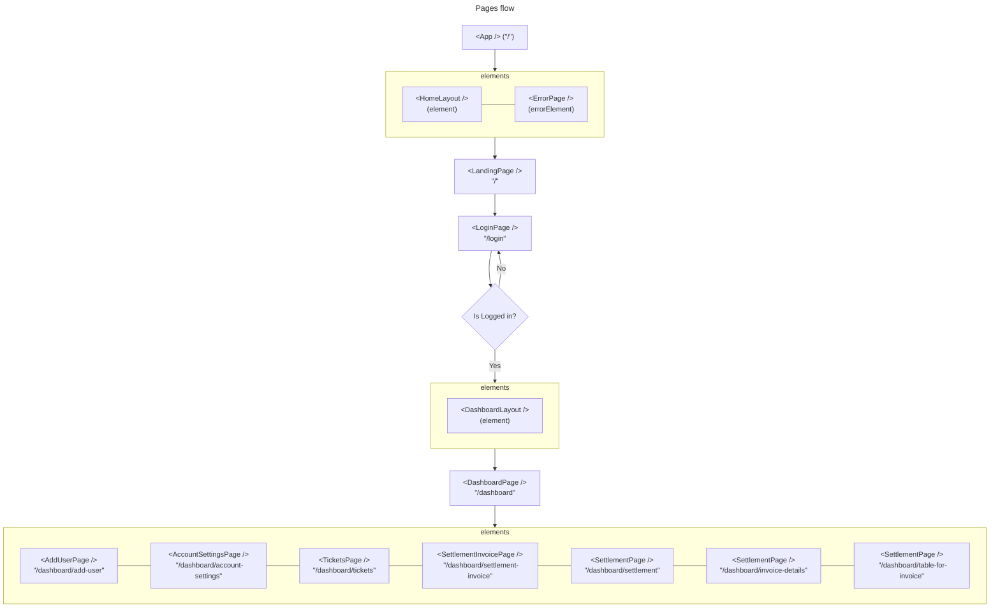

![][banner-url]

<div align="center">

# MARS frontend 1.0

**jti-mars-frontend**

</div>

## Setup

Prerequisite for Windows Only✨
[**Gitbash**][gitbash-url]

To run this project, install locally using npm

Clone the project

```bash
  git clone https://github.com/Journeytech-Inc/jti-mars-react-web-app.git
```

Go to the project directory

```bash
  cd jti-mars-react-web-app
```

Run this on **VS Code** bash terminal.

```bash
  npm start
```

_This will install all the dependencies and then run in development mode._

## Route Reference

**Root Routes**

| Route    | Description         |
| -------- | ------------------- |
| `/`      | Landing Page        |
| `/login` | For logging in user |

**Dashboard Routes**

| Route                           | Description                                                                 |
| ------------------------------- | --------------------------------------------------------------------------- |
| `/dashboard`                    | Page for different kinds of data to generate and translate to charts        |
| `/dashboard/add-user`           | Page for adding user                                                        |
| `/dashboard/account-settings`   | Page for customizing the account's settings of the currently logged in user |
| `/dashboard/tickets`            | List of Tickets                                                             |
| `/dashboard/settlement`         | Settlement of each Invoice ID                                               |
| `/dashboard/settlement-invoice` | Page for a specific settlement invoice                                      |
| `/dashboard/invoice-details`    | Page for a specific invoice                                                 |
| `/dashboard/table-for-invoice`  | List of all invoice                                                         |

**Pages flow**



## Built with

-   React frontend ✨
-   Tailwind
-   Tailwind merge
-   DaisyUI
-   Mobile-first workflow
-   Semantic HTML5 markup
-   CSS custom properties
-   Flexbox
-   CSS Grid
-   SCSS

## Links

-   [Changelogs][changelogs-anton-url]

[banner-url]: https://raw.githubusercontent.com/A14313/jti-mars-react-web-app-images/main/images/mars-banner.jpg
[gitbash-url]: https://gitforwindows.org/
[changelogs-anton-url]: https://github.com/Journeytech-Inc/jti-mars-react-web-app/blob/main/changelogs.md
